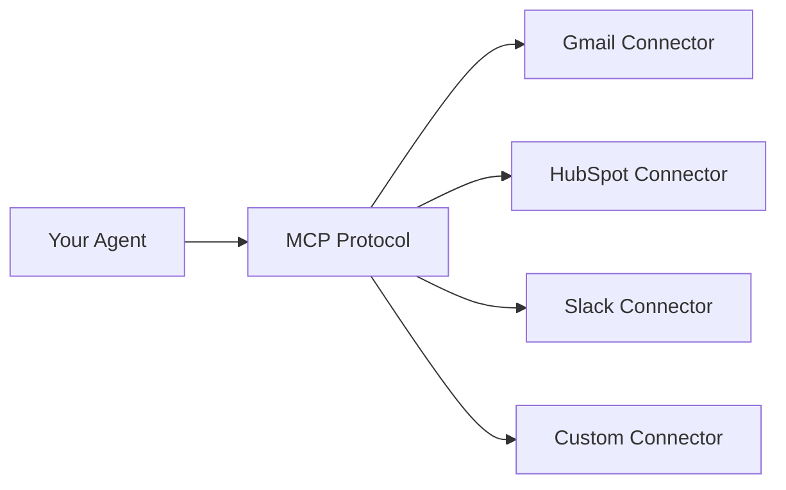

## What is MCP?

**MCP (Model Context Protocol)** is an open protocol that allows AI agents to connect to external tools and services. Think of it as a universal adapter that lets your agent interact with Gmail, Salesforce, Slack, and any other service.

## How MCP Works



1. **Agent receives user request** - "Send an email to john@example.com"
2. **Agent decides to use a tool** - Determines Gmail tool is needed
3. **MCP protocol bridges the connection** - Standardized communication
4. **Connector executes the action** - Actually sends the email via Gmail API
5. **Result returns to agent** - "Email sent successfully"

## Key Concepts

### Connectors

**Connectors** are MCP-compatible servers that provide tools to your agent.

```javascript
// A connector provides tools like:
{
  "name": "gmail",
  "tools": [
    "send_email",
    "read_emails",
    "search_emails",
    "reply_to_email"
  ]
}
```

### Tools

**Tools** are individual actions your agent can perform through a connector.

```javascript
// Example: Gmail's send_email tool
{
  "name": "send_email",
  "description": "Send an email message",
  "parameters": {
    "to": "recipient@example.com",
    "subject": "Meeting reminder",
    "body": "Don't forget our 3pm meeting"
  }
}
```

### Tool Calling

When your agent needs to use a tool:

1. **Agent analyzes user request** - Understands what action is needed
2. **Agent selects appropriate tool** - Chooses "send_email" from Gmail connector
3. **Agent prepares parameters** - Extracts to, subject, body from context
4. **MCP executes tool** - Connector sends the email
5. **Agent receives result** - Uses response to continue conversation

## Two Types of Connectors

### 1. Pre-built Connectors

BoostGPT provides 30+ ready-to-use connectors:

- **Managed by BoostGPT** - We handle hosting, updates, and maintenance
- **OAuth authentication** - Secure connection to your accounts
- **One-click deployment** - Just authenticate and connect

**Example: Deploying Gmail**

```text
Dashboard -> Integrations -> Connectors -> Gmail -> Deploy
-> Authenticate with Google -> Add to Agent Tools
```

### 2. External MCP Servers

Connect any MCP-compatible server from the internet:

- **You provide the URL** - Point to any MCP server
- **Third-party or self-hosted** - Host your own or use community servers
- **Custom tools** - Access specialized tools not in our library

**Example: Connecting external server**

```text
Agent -> Tools Tab -> Add Tool -> Add New
-> Enter MCP URL: https://mcp.example.com -> Connect
```

## MCP Protocol Flow

```javascript
// 1. Agent decides to use a tool
User: "Send an email to john@example.com about the meeting"

// 2. Agent makes MCP request
{
  "connector": "gmail",
  "tool": "send_email",
  "parameters": {
    "to": "john@example.com",
    "subject": "Meeting reminder",
    "body": "Don't forget our meeting at 3pm today"
  }
}

// 3. Connector executes via Gmail API
Gmail API.sendEmail({...})

// 4. MCP returns result
{
  "success": true,
  "message_id": "msg_abc123",
  "timestamp": "2025-01-05T15:30:00Z"
}

// 5. Agent responds to user
Agent: "I've sent the email to john@example.com"
```

## Authentication

### OAuth Flow (Pre-built Connectors)

```text
1. User clicks "Deploy" on connector
2. Redirected to service (e.g., Google)
3. User grants permissions
4. BoostGPT receives access token
5. Connector can now act on user's behalf
```

### API Key (External Servers)

```text
1. Get API key from MCP server provider
2. Enter URL when connecting to agent
3. Optionally provide API key if required
4. Connector authenticates with external service
```

## Security

### Pre-built Connectors

- **OAuth 2.0** - Industry-standard secure authentication
- **Encrypted storage** - Tokens encrypted at rest
- **Scoped permissions** - Only request necessary permissions
- **Revokable access** - Disconnect anytime from Dashboard

### External Servers

- **HTTPS required** - All MCP servers must use HTTPS
- **You control access** - Manage authentication yourself
- **Audit logs** - See all tool executions in agent Insights

## Real-World Example

### Building a Sales Agent

```javascript
// 1. Deploy connectors
Dashboard -> Integrations -> Connectors:
  - Deploy Salesforce
  - Deploy Gmail
  - Deploy Google Calendar

// 2. Add to agent
Agent -> Tools Tab:
  - Add Salesforce connector
  - Add Gmail connector
  - Add Calendar connector

// 3. Agent can now:
User: "Show me all deals closing this month"
Agent: *uses Salesforce* "Found 8 deals worth $340K..."

User: "Email the sales rep for the biggest deal"
Agent: *uses Salesforce to get contact, Gmail to send* "Emailed Sarah at..."

User: "Schedule a review meeting for next week"
Agent: *uses Calendar* "Meeting scheduled for Jan 12 at 10am"
```

## MCP vs Direct API Integration

| Feature | MCP Protocol | Direct API |
|---------|-------------|-----------|
| **Setup** | Deploy connector, add to agent | Write custom code for each API |
| **Maintenance** | Automatic updates | Manual updates required |
| **Authentication** | OAuth handled for you | Implement OAuth yourself |
| **Agent Access** | Automatic tool calling | Manual prompt engineering |
| **Multi-service** | One pattern for all | Different code per service |

## Supported Tool Types

MCP connectors can provide various tool types:

### Data Access
- Read data (emails, contacts, files)
- Search and filter
- Query databases

### Actions
- Send messages
- Create records
- Update information
- Delete items

### Scheduled Tasks
- Set reminders
- Schedule events
- Automate workflows

### Real-time
- Subscribe to events
- Stream data
- Webhooks

## Building Your Own Connector

Want to create a custom MCP connector? See our guide:

<CardGroup cols={2}>
  <Card title="Creating Connectors" icon="code" href="/integrations/custom/creating-connector">
    Build your own MCP connector
  </Card>
  <Card title="MCP Protocol Spec" icon="book" href="/integrations/custom/mcp-protocol">
    Technical protocol details
  </Card>
</CardGroup>

## Debugging Tools

### Agent Insights

View all tool executions:

```text
Agent -> Insights Tab -> Tool Analytics
- See which tools are called
- View success/failure rates
- Monitor response times
```

### Test in Playground

```text
Agent -> Playground Tab
- Ask agent to use tools
- See real-time tool execution
- Debug parameter passing
```

## Limitations

### Rate Limits

Each service has its own rate limits:

- **Gmail**: 100 emails/day (free), 2,000/day (Google Workspace)
- **Salesforce**: API limits by license tier
- **HubSpot**: 100 requests/10 seconds

Your agent automatically respects these limits.

### Permissions

Agents can only use tools you've connected:

```javascript
// If only Gmail is connected:
User: "Create a Salesforce contact"
Agent: "I don't have access to Salesforce. Please connect it first."
```

### Connector Availability

By plan:

| Plan | Connectors |
|------|-----------|
| **Free** | 1 connector |
| **Starter** | 5 connectors |
| **Pro** | 20 connectors |
| **Scale** | Unlimited |

## Next Steps

<CardGroup cols={2}>
  <Card title="Quickstart" icon="rocket" href="/integrations/quickstart">
    Deploy your first connector
  </Card>
  <Card title="Browse Connectors" icon="grid" href="/integrations/connectors/overview">
    See all available connectors
  </Card>
  <Card title="Build Custom" icon="code" href="/integrations/custom/overview">
    Create your own connector
  </Card>
  <Card title="External Tools" icon="plug" href="/integrations/external-tools/overview">
    Connect third-party servers
  </Card>
</CardGroup>