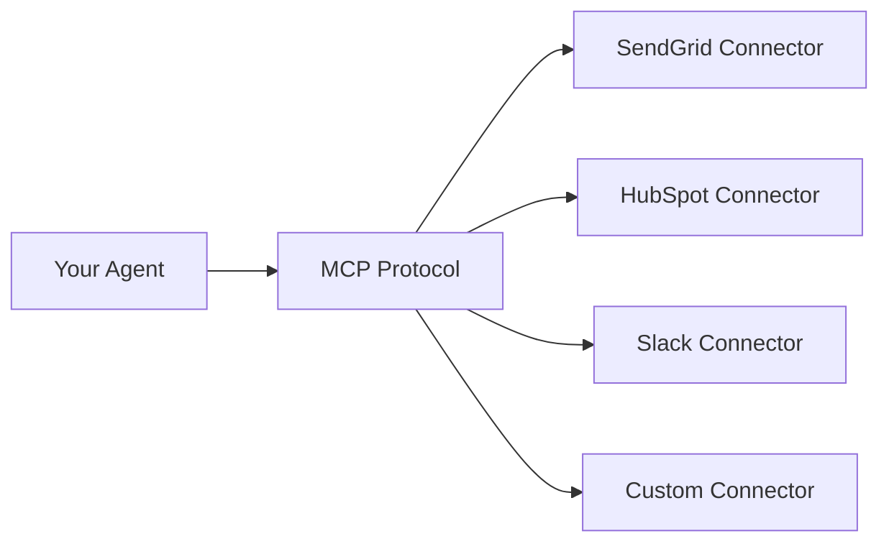

## What is MCP?

**MCP (Model Context Protocol)** is an open protocol that allows AI agents to connect to external tools and services. Think of it as a universal adapter that lets your agent interact with Slack, HubSpot, Calendly, and any other service.

## How MCP Works


```mermaid
graph LR
    A[Your Agent] --> B[MCP Protocol]
    B --> C[SendGrid Connector]
    B --> D[HubSpot Connector]
    B --> E[Slack Connector]
    B --> F[Custom Connector]
```

1. **Agent receives user request** - "Send an email to john@example.com"
2. **Agent decides to use a tool** - Determines SendGrid tool is needed
3. **MCP protocol bridges the connection** - Standardized communication
4. **Connector executes the action** - Actually sends the email via SendGrid API
5. **Result returns to agent** - "Email sent successfully"

## Key Concepts

### Connectors

**Connectors** are MCP-compatible servers that provide tools to your agent.

```javascript
// A connector provides tools like:
{
  "name": "sendgrid",
  "tools": [
    "send_email",
    "read_emails",
    "search_emails",
    "reply_to_email"
  ]
}
```

### Tools

**Tools** are individual actions your agent can perform through a connector.

```javascript
// Example: SendGrid's send_email tool
{
  "name": "send_email",
  "description": "Send an email message",
  "parameters": {
    "to": "recipient@example.com",
    "subject": "Meeting reminder",
    "body": "Don't forget our 3pm meeting"
  }
}
```

### Tool Calling

When your agent needs to use a tool:

1. **Agent analyzes user request** - Understands what action is needed
2. **Agent selects appropriate tool** - Chooses "send_email" from SendGrid connector
3. **Agent prepares parameters** - Extracts to, subject, body from context
4. **MCP executes tool** - Connector sends the email
5. **Agent receives result** - Uses response to continue conversation

## Two Types of Connectors

### 1. Pre-built Connectors

BoostGPT provides 30+ ready-to-use connectors:

- **Managed by BoostGPT** - We handle hosting, updates, and maintenance
- **Checked before it is saved** - A credential the vendor refuses never becomes a connection
- **Connected once** - The workspace holds it; each agent is then allowed to use it

**Example: connecting SendGrid**

```text
Dashboard -> Connectors -> SendGrid -> Connect -> paste the API key
-> the agent's Connectors tab -> add it
```

### 2. External MCP Servers

Connect any MCP-compatible server from the internet:

- **You provide the URL** - Point to any MCP server
- **Third-party or self-hosted** - Host your own or use community servers
- **Custom tools** - Access specialized tools not in our library

**Example: Connecting external server**

```text
Agent -> Tools Tab -> Add Tool -> Add New
-> Enter MCP URL: https://mcp.example.com -> Connect
```

## MCP Protocol Flow

```javascript
// 1. Agent decides to use a tool
User: "Send an email to john@example.com about the meeting"

// 2. Agent makes MCP request
{
  "connector": "sendgrid",
  "tool": "send_email",
  "parameters": {
    "to": "john@example.com",
    "subject": "Meeting reminder",
    "body": "Don't forget our meeting at 3pm today"
  }
}

// 3. Connector executes via SendGrid API
SendGrid API.sendEmail({...})

// 4. MCP returns result
{
  "success": true,
  "message_id": "msg_abc123",
  "timestamp": "2025-01-05T15:30:00Z"
}

// 5. Agent responds to user
Agent: "I've sent the email to john@example.com"
```

## Authentication

### Signing in (connectors and remote servers)

```text
1. User presses Connect
2. Redirected to the service to approve access
3. The code is exchanged server-side; the browser never sees a token
4. The connection is created — only now, and only if that succeeded
5. Its tools are read from the server and stored
```

### API Key (External Servers)

```text
1. Get API key from MCP server provider
2. Enter URL when connecting to agent
3. Optionally provide API key if required
4. Connector authenticates with external service
```

## Security

### Pre-built Connectors

- **OAuth 2.0** - Industry-standard secure authentication
- **Encrypted storage** - Tokens encrypted at rest
- **Scoped permissions** - Only request necessary permissions
- **Revokable access** - Disconnect anytime from Dashboard

### External Servers

- **HTTPS required** - All MCP servers must use HTTPS
- **You control access** - Manage authentication yourself
- **Audit logs** - See all tool executions in agent Insights

## Real-World Example

### An agent that keeps the marketing site honest

```text
1. Connect, once, on the Connectors screen:
   - HubSpot     who asked, and what they asked about
   - Serper      what people search for before they find you
   - WordPress   the pages themselves

2. Allow them, per agent, from its Connectors tab.

3. Then:

User:  "What are people asking sales that the pricing page doesn't answer?"
Agent: *reads HubSpot deals and notes* "Six of the last twelve asked about
       per-seat vs usage billing. The pricing page never uses the word 'seat'."

User:  "What do people search for around that?"
Agent: *uses Serper* "'per seat pricing', 'usage based pricing calculator',
       'how much does X cost for 5 users'."

User:  "Add a short section answering it."
Agent: *edits the page in WordPress* "Added 'What counts as a seat?' under
       the pricing table."
```

## MCP vs Direct API Integration

| Feature | MCP Protocol | Direct API |
|---------|-------------|-----------|
| **Setup** | Connect once, allow per agent | Write custom code for each API |
| **Maintenance** | Automatic updates | Manual updates required |
| **Authentication** | Sign-in handled for you, and checked before it is saved | Implement OAuth yourself |
| **Agent Access** | Automatic tool calling | Manual prompt engineering |
| **Multi-service** | One pattern for all | Different code per service |

## Supported Tool Types

MCP connectors can provide various tool types:

### Data Access
- Read data (emails, contacts, files)
- Search and filter
- Query databases

### Actions
- Send messages
- Create records
- Update information
- Delete items

### Scheduled Tasks
- Set reminders
- Schedule events
- Automate workflows

### Real-time
- Subscribe to events
- Stream data
- Webhooks

## Building Your Own Connector

Want to create a custom MCP connector? See our guide:

<CardGroup cols={2}>
  <Card title="Creating Connectors" icon="code" href="/integrations/custom/overview">
    Build your own MCP connector
  </Card>
  <Card title="MCP Protocol Spec" icon="book" href="/integrations/custom/openapi">
    Technical protocol details
  </Card>
</CardGroup>

## Debugging Tools

### Agent Insights

View all tool executions:

```text
Agent -> Insights Tab -> Tool Analytics
- See which tools are called
- View success/failure rates
- Monitor response times
```

### Test in Playground

```text
Agent -> Playground Tab
- Ask agent to use tools
- See real-time tool execution
- Debug parameter passing
```

## Limitations

### Rate limits

Every service has its own, and they are the vendor's to enforce: HubSpot allows 100 requests per 10 seconds,
most AI providers meter by tokens or images, and a free tier is usually stricter than a paid one. When a vendor
refuses a call, the agent is told in the vendor's own words rather than being left to guess.

BoostGPT counts calls too — every connector call is logged and charged against your plan's allowance, whichever
connector made it.

### Permissions

An agent can only use what you have connected and left switched on:

```text
User:  "Create a HubSpot contact for this lead"
Agent: "I don't have HubSpot connected. Add it from the Connectors screen and I can."
```

A tool switched off in a connection's settings is invisible to the agent — it is not offered and then refused.

### How many connections

Each plan allows a number of **connections**, not connectors: two connections of the same service — a live
Stripe and a test one — count as two. The Connectors screen shows where you stand against your plan in its
header, and creating one past the limit is refused before anything is made.

## Next Steps

<CardGroup cols={2}>
  <Card title="Quickstart" icon="rocket" href="/integrations/quickstart">
    Connect your first service
  </Card>
  <Card title="Browse Connectors" icon="grid" href="/integrations/connectors/overview">
    See all available connectors
  </Card>
  <Card title="Build Custom" icon="code" href="/integrations/custom/overview">
    Create your own connector
  </Card>
  <Card title="Remote MCP servers" icon="server" href="/integrations/remote-mcp">
    Connect a server the vendor runs
  </Card>
</CardGroup>
