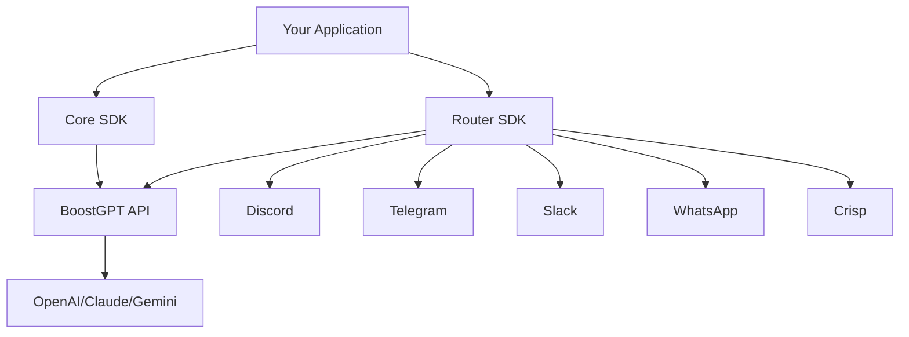

## Two SDKs, One Platform

BoostGPT provides two complementary SDKs that work together:

<CardGroup cols={2}>
  <Card
    title="Core SDK"
    icon="brain"
    href="/sdk/core/installation"
  >
    **`boostgpt`**
    
    Manage bots, chat API, training data, and knowledge base
  </Card>
  <Card
    title="Router SDK"
    icon="merge"
    href="/sdk/router/installation"
  >
    **`@boostgpt/router`**
    
    Deploy bots to Discord, Telegram, Slack, WhatsApp, and Crisp
  </Card>
</CardGroup>

## When to Use Each SDK

<Tabs>
  <Tab title="Core SDK">
    Use the **Core SDK** when you need to:
    
    - Create and manage AI bots
    - Configure bot behavior and models
    - Add training data and knowledge sources
    - Send chat messages programmatically
    - Search your bot's knowledge base
    - Manage chat history
    - Build custom web interfaces
    
    ```javascript
    import { BoostGPT } from 'boostgpt';
    
    const client = new BoostGPT({
      key: process.env.BOOSTGPT_API_KEY,
      project_id: process.env.BOOSTGPT_PROJECT_ID
    });
    
    // Create a bot
    await client.createBot({
      name: 'Support Bot',
      model: 'gpt-4o-mini',
      instruction: 'You are a helpful support agent'
    });
    
    // Chat with the bot
    const response = await client.chat({
      bot_id: 'bot-123',
      message: 'Hello!',
      chat_id: 'user-456'
    });
    ```
  </Tab>
  
  <Tab title="Router SDK">
    Use the **Router SDK** when you need to:
    
    - Deploy bots to multiple messaging platforms
    - Handle messages from Discord, Telegram, Slack, etc.
    - Normalize messages across different channels
    - Build omnichannel AI agents
    - Create unified message handlers
    
    ```javascript
    import { Router, DiscordAdapter, TelegramAdapter } from '@boostgpt/router';
    
    const router = new Router({
      apiKey: process.env.BOOSTGPT_API_KEY,
      projectId: process.env.BOOSTGPT_PROJECT_ID,
      adapters: [
        new DiscordAdapter({ discordToken: process.env.DISCORD_TOKEN }),
        new TelegramAdapter({ telegramToken: process.env.TELEGRAM_TOKEN })
      ]
    });
    
    // One handler for ALL channels
    router.onMessage(async (message, context) => {
      console.log(`${context.channel}: ${message.content}`);
      return 'Response here';
    });
    
    await router.start();
    ```
  </Tab>
  
  <Tab title="Both Together">
    Use **both SDKs** for the complete solution:
    
    ```javascript
    import { BoostGPT } from 'boostgpt';
    import { Router, DiscordAdapter } from '@boostgpt/router';
    
    // Core SDK - Manage your bot
    const client = new BoostGPT({
      key: process.env.BOOSTGPT_API_KEY,
      project_id: process.env.BOOSTGPT_PROJECT_ID
    });
    
    // Create or update bot configuration
    await client.updateBot({
      bot_id: process.env.BOOSTGPT_BOT_ID,
      model: 'gpt-4o-mini',
      instruction: 'Updated instructions'
    });
    
    // Router SDK - Deploy to channels
    const router = new Router({
      apiKey: process.env.BOOSTGPT_API_KEY,
      projectId: process.env.BOOSTGPT_PROJECT_ID,
      defaultBotId: process.env.BOOSTGPT_BOT_ID,
      adapters: [
        new DiscordAdapter({ discordToken: process.env.DISCORD_TOKEN })
      ]
    });
    
    await router.start();
    // Your bot is now live on Discord!
    ```
  </Tab>
</Tabs>

## Architecture Overview



## Feature Comparison

| Feature | Core SDK | Router SDK |
|---------|----------|------------|
| Bot Management | ✅ | ❌ |
| Training Data | ✅ | ❌ |
| Chat API | ✅ | ✅ (via router) |
| Discord Support | ❌ | ✅ |
| Telegram Support | ❌ | ✅ |
| Slack Support | ❌ | ✅ |
| WhatsApp Support | ❌ | ✅ |
| Crisp Support | ❌ | ✅ |
| Unified Message Handler | ❌ | ✅ |
| Custom Adapters | ❌ | ✅ |

## Installation

<Tabs>
  <Tab title="Core SDK Only">
    ```bash
    npm install boostgpt
    ```
  </Tab>
  
  <Tab title="Router SDK Only">
    ```bash
    npm install boostgpt @boostgpt/router
    ```
    
    <Info>
      The Router SDK depends on `boostgpt`, so you need to install both.
    </Info>
  </Tab>
  
  <Tab title="Both">
    ```bash
    npm install boostgpt @boostgpt/router
    ```
  </Tab>
</Tabs>

## Common Patterns

### Pattern 1: Web App + API

Use **Core SDK only** for web applications:

```javascript
import { BoostGPT } from 'boostgpt';

// In your web backend
app.post('/api/chat', async (req, res) => {
  const client = new BoostGPT({ key, project_id });
  
  const result = await client.chat({
    bot_id: 'bot-123',
    message: req.body.message,
    chat_id: req.user.id
  });
  
  res.json(result.response);
});
```

### Pattern 2: Multi-Channel Bot

Use **Router SDK** for omnichannel deployment:

```javascript
import { Router, DiscordAdapter, TelegramAdapter } from '@boostgpt/router';

const router = new Router({
  apiKey: process.env.BOOSTGPT_API_KEY,
  projectId: process.env.BOOSTGPT_PROJECT_ID,
  defaultBotId: process.env.BOOSTGPT_BOT_ID,
  adapters: [
    new DiscordAdapter({ discordToken: process.env.DISCORD_TOKEN }),
    new TelegramAdapter({ telegramToken: process.env.TELEGRAM_TOKEN })
  ]
});

await router.start();
```

### Pattern 3: Dynamic Bot Configuration

Use **both SDKs** for advanced use cases:

```javascript
import { BoostGPT } from 'boostgpt';
import { Router, DiscordAdapter } from '@boostgpt/router';

const client = new BoostGPT({ key, project_id });
const router = new Router({ apiKey, projectId, adapters: [...] });

// Dynamically update bot behavior
router.onMessage(async (message, context) => {
  // Check if it's a command to update the bot
  if (message.content.startsWith('/setmodel')) {
    const model = message.content.split(' ')[1];
    
    await client.updateBot({
      bot_id: context.adapter.botId,
      model: model
    });
    
    return `Model updated to ${model}`;
  }
  
  // Normal chat handling
  return null;
});
```

## Module Systems

Both SDKs support ES Modules and CommonJS:

<Tabs>
  <Tab title="ES Modules (Recommended)">
    ```javascript
    import { BoostGPT } from 'boostgpt';
    import { Router, DiscordAdapter } from '@boostgpt/router';
    ```
    
    Requires Node.js 14+ and `"type": "module"` in `package.json` or `.mjs` file extension.
  </Tab>
  
  <Tab title="CommonJS">
    ```javascript
    const { BoostGPT } = require('boostgpt');
    const { Router, DiscordAdapter } = require('@boostgpt/router');
    ```
    
    Works with any Node.js version 12+.
  </Tab>
</Tabs>

## Next Steps

<CardGroup cols={2}>
  <Card
    title="Core SDK Installation"
    icon="download"
    href="/sdk/core/installation"
  >
    Install and configure the Core SDK
  </Card>
  <Card
    title="Router SDK Installation"
    icon="download"
    href="/sdk/router/installation"
  >
    Install and configure the Router SDK
  </Card>
  <Card
    title="Core API Reference"
    icon="book"
    href="/sdk/core/api-reference"
  >
    Explore Core SDK methods
  </Card>
  <Card
    title="Router API Reference"
    icon="book"
    href="/sdk/router/api-reference"
  >
    Explore Router SDK methods
  </Card>
</CardGroup>